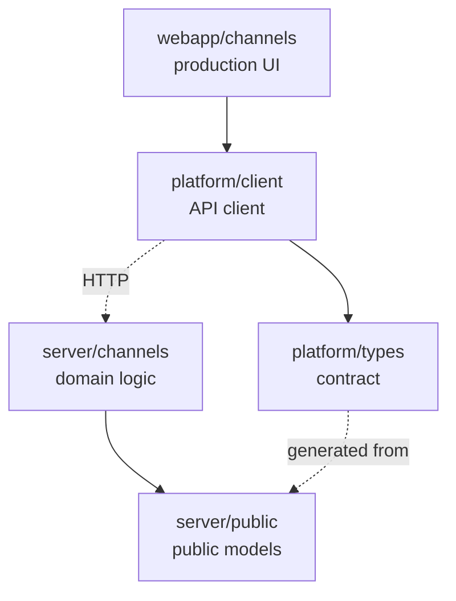

# Project map - the final synthesis

After three components you have plenty of signals but not yet a map. A project map is a **synthesis of evidence**, not a stack of tables glued together.

The measurable goal: **a new developer, after 15 minutes of reading, knows where things live, what is dangerous, and where to start.**

Output: `context/map/repo-map.md`.

## Step 0: inputs

```bash
ls -la context/map/
```

You need `artifact-1-territory.md`, `artifact-2-structure.md`, `artifact-3-contributors.md`. Whatever is missing, say so plainly and either offer to close that step (`repo-territory` / `repo-structure` / `repo-contributors`) or note the gap in the Limitations section. A map from two components is fine, as long as it states which perspective is missing.

**Do not generate data from scratch and do not reproduce the artifacts' tables wholesale.** Your job here is merging, prioritizing and discarding.

## Step 1: synthesis rules

1. **Merge the three perspectives into one picture**: where the system lives → how it is connected → who to ask. Each risk zone should carry all three where possible.
2. **Show the real boundaries**, especially the places where the directory structure does **not** match actual activity. That is the single most valuable thing for a newcomer, because the directory tree is what lies most often.
3. **Lead from the wide view to 5-8 "first files to read"** - concrete paths, not categories.
4. **State the window**: this is a map of activity and structure over 12 months, not a description of the whole project.
5. **For each coupling, note how you know it**: from the import graph, from git history, or that it is an area the tooling never covered. A layer without a graph is an `unknown`, not "no connections".
6. **Separate hand-edited coupling from regeneration.** If things change together because they are generated or mocked rather than hand-edited, flag it - a change by regeneration is cheaper and weighs differently in a cost estimate.

## Step 2: classify the areas

Before writing risk zones, give the areas working labels. The full label system (core/supporting/peripheral, deep/shallow, stable/volatile/seasonal, load-bearing/contained, sensitivity, coupling types, the `evidence → inference → caution → unknowns` format) lives in **`references/classification.md`** - read it.

The rule that governs the whole map: **a label without evidence is a guess**. If you write that the payments module is core, show how you know - an entry point, a public contract, frequent use by other modules, a link to the main flow. A folder name **is not evidence**.

If an area is interesting but does not look sensitive, note it briefly or leave it out. The map should be decision-grade, not complete.

## Step 3: document structure

Template to fill in: `assets/repo-map-template.md`. Sections:

1. **TL;DR** (5-7 sentences) - what the repo is, the main layers (Mermaid diagram), where work concentrates, where it hurts.
2. **Terrain** - heavy responsibility vs periphery; deep and shallow modules; activity over time.
3. **Real connections** - what actually changes together (couplings + layers + cycles), each with its source of evidence.
4. **Risk zones** - 4-6 high-risk areas, each with a one-line "why".
5. **Who to ask** - per zone: 1-2 thematically matched candidates.
6. **First day** - an ordered list of 5-8 entry files/modules to read, with a one-sentence rationale each.
7. **Limitations** - time window, method, what the map does NOT say.

Format: Markdown with Mermaid, terse, tables only where they genuinely help.

## Step 4: the diagram

One Mermaid diagram in the TL;DR, showing layers and dependency direction. Roughly 10 nodes maximum. If you feel like adding a twelfth, that is a sign the diagram stopped answering "how is this built" and started describing the repo.



Use dashed lines for couplings invisible in imports (HTTP, codegen, runtime) - the reader immediately sees it is a different class of evidence.

## Step 5: usefulness check before saving

Before writing the file, test the map with the question it exists for: **"where in this legacy code do I need to be careful?"** If the document does not answer that in under a minute of reading, it is too long or too vague.

Second check - the map must not be a picture without a decision. A good map ends in statements like: "these areas genuinely matter; here a change is most likely to ripple through several layers; here check the evidence, tests, PR history and unknowns first".

Third - does every risk zone have evidence from a specific artifact? If not, remove it or move it to `unknowns`.

## Step 6: save and hand off

Write to `context/map/repo-map.md`. Also propose one line in the root `AGENTS.md`/`CLAUDE.md` under `Reference`, so an agent in a later session knows the map exists:

```markdown
- `context/map/repo-map.md` - repository map, risk zones, entry points (scanned: <date>)
```

The natural follow-up: pick **one** risk zone and go into Deep Focus - tracing the real data flow through a single feature. Wide Scan deliberately does not do that; its job was to narrow the search, not to understand the system.

## Maintenance

The map is dated and it ages. State in it explicitly that a rescan is worth doing after a larger refactor or after roughly 6 months. A map without a scan date is worse than no map, because nobody knows whether it still holds.
