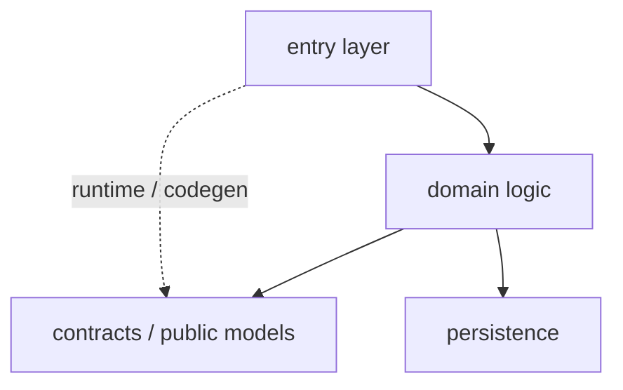

# Project map - <repo name>

> Scanned: <YYYY-MM-DD> · HEAD `<sha>` · history window: 12 months
> Sources: `artifact-1-territory.md`, `artifact-2-structure.md`, `artifact-3-contributors.md`
> This map describes **activity and structure within a 12-month window**, not the whole project.

## 1. TL;DR

<5-7 sentences: what this repo is, its main layers, where work concentrates, where it hurts.>

<Solid line = dependency visible in the import graph. Dashed line = coupling known from
git history, HTTP, codegen or runtime - a different class of evidence.>

## 2. Terrain - where the system lives

| Area | Role | Change profile | Activity (12m) | Evidence |
|---|---|---|---|---|
| | core / supporting / peripheral | stable / volatile / seasonal | | territory / graph |

**Heavy responsibility:** <2-4 areas>
**Periphery:** <areas that look important but are not>
**Where the directory tree lies:** <places where the folder layout does not match real activity - the most valuable point in this section>

## 3. Real connections - what actually changes together

| Connection | How I know | Kind (hand-edited / regenerated / runtime) | What it means for a change |
|---|---|---|---|
| | import graph / git history / no tooling (`unknown`) | | |

**Cycles:** <list plus a one-sentence "why this hurts">
**Layer boundaries:** <which hold, which leak>

## 4. Risk zones

> 4-6 areas. Each with a one-line "why" and its evidence.

### <zone name> - sensitivity: high/medium/low
- **evidence:** <concrete evidence from an artifact>
- **inference:** <what follows from it>
- **caution:** <what to check before changing>
- **unknowns:** <what the method did not show>

## 5. Who to ask

| Zone | Person | What they are deep in | What specifically to ask |
|---|---|---|---|

<If knowledge of a zone sits with one person, record it as a risk (bus factor).>

## 6. First day - what to read, in this order

1. `<path>` - <why this, why now>
2. `<path>` - <...>
3. ...

> 5-8 entries. Concrete paths, not categories. The order matters: start at the entry
> point, end where the real logic begins.

## 7. Limitations - what this map does NOT say

- Window: 12 months. Areas stable for years may be a critical core nobody touches.
- History shows **where** the project was touched, not **why** and not whether it was right.
- The static graph cannot see runtime coupling: DI, dynamic imports, feature flags, configuration, queues, webhooks, codegen, reflection.
- Layers with no dependency graph: <list> - that is an `unknown`, not "no connections".
- Co-changes will not reveal a contract that **should** be kept in sync and is not.
- The contributor map shows who touched the code - not who owns it, nor whether they are still on the team.
- Squash merges and mass renames distort the counters.

**When to rescan:** after a larger refactor, or in roughly 6 months.
